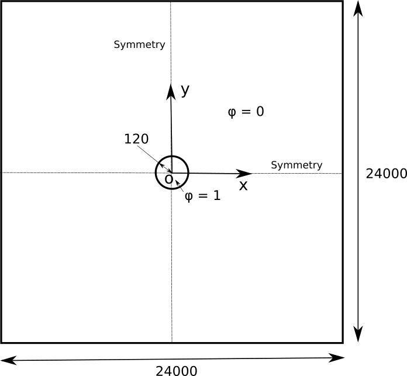

```{r setup, include=FALSE}
knitr::opts_chunk$set(echo = TRUE)
```

This is a two-phase two-component phase-field solver for OpenFOAM based on finite-volume discretization, with dynamically refining interface, and first order implicit Euler time integration scheme. The solver can be decomposed into multiple domains for parallel runs. To carry out the simulations, the steps mentioned below can be followed.

# Isothermal undercooling

The first case is conducted by keeping the temperature constant and uniform throughout the melt.

## Problem specification

The problem is defined as follows:

***Solution domain*** The domain is considered to be two-dimensional in this problem. The square domain consists of a cylindrical undercooled region collocated with the centre of the square as shown in Figure 1.

```{r geomfg, echo=FALSE, out.width='50%', fig.align = 'center', fig.cap = "Figure 1: Geometry of the melt with an undercooled region."}

```

***Governing equations*** The basic idea of the phase-field model consists in the description of the evolution of individual phases using the corresponding set of order parameters (the phase-field variables). For each phase, the associated phase-field variable is equal to 1 inside the phase and vanishes to 0 outside the area occupied by the considered phase. The transition of phase fields from 1 to 0 at the phase boundaries is continuous and smooth, i.e.,the phase boundaries are represented by diffuse interfaces with a finite thickness. Phase evolution is determined by the phenomenological minimization of the functional, which is formulated as the grand- potential functional (@Choudhury). The evolution equation for two phase-field variable can be written as:

$$
{\omega}{\epsilon}{\frac {\partial \phi} {\partial t}} = {\epsilon}\left({\nabla}\cdot{\frac {\partial a({\nabla}\phi)} {\partial {\nabla}\phi}}\right) - {\frac {1} {\epsilon}}{\frac {\partial w(\phi)} {\partial \phi}} - {\frac {\partial \Psi(T, \mu, \phi)} {\partial \phi}}
\tag{1}
\label{1}
$$

* The double well potential $w(\phi)$ can be written as:

$$
w(\phi) = {\gamma}{\phi}^2(1-{\phi})^2
\tag{2}
\label{2}
$$

* The gradient energy density, $a({\nabla}\phi)$ has the form:

$$
a({\nabla}\phi) = {\gamma}[a_c(q)]^2 |q|^2
\tag{3}
\label{3}
$$
where $q = |{\nabla}\phi|$ is the normal vector to the interface, ${\gamma}$ controls the interfacial energy of the system and is known as surface energy density. $a_c(q)$ describes the anisotropy of evolving phase boundary. In case of four-fold symmetry $a_c({\nabla}\phi) = 1 + \delta\cos(4\theta)$ where $\theta$ is the orientation of the interface and is computed in 2D as (@Boettinger):

$$
\tan{\theta} = \left({\frac {\partial{\phi}} {\partial{y}}}\right)/\left({\frac {\partial{\phi}} {\partial{x}}}\right)
\tag{4}
\label{4}
$$
where $x$ and $y$ define the coordinate system. Using above expression for $\theta$, anisotropy can be represented as:

$$
a_c(\nabla \phi) = 1 - \delta \left(3 - {\frac {4[(\nabla_x \phi)^4+(\nabla_y \phi)^4+(\nabla_z \phi)^4]} {|\nabla \phi|^4}}\right)
\tag{5}
\label{5}
$$
where $\delta$ is the strength of anisotropy. $\nabla_x \phi$ is the x-component of $\nabla \phi$ and so on. The first term on the right hand side of evolution equation is then written as:

$$
{\frac {\partial a({\nabla}\phi)} {\partial {\nabla}\phi}} = 2{\gamma}a_c(\nabla \phi){\frac {\partial a_c({\nabla}\phi)} {\partial {\nabla}\phi}}|\nabla \phi|^2 + 2{\gamma}{\nabla \phi}[a_c(\nabla \phi)]^2
\tag{6}
\label{6}
$$

* The last term in equation (1) is related to the thermodynamic driving force. The grand potentials $\Psi(T,\mu)$ can be expressed as a linear expansion about the equilibrium chemical potential $\mu_{eq}$:

$$
\Psi_\alpha (T,\mu) = \Psi_\alpha (T,\mu_{eq}) + {\frac {\partial \Psi_\alpha (T,\mu)} {\partial \mu}}|_{\mu_{eq}} (\mu - \mu_{eq})
\tag{7}
\label{7}
$$

* The driving force $\Delta F^\alpha$ is then written as:

$$
\begin{aligned}
&\Delta F^\alpha = [\Psi_\alpha (T,\mu) - \Psi_\beta (T,\mu)]{\frac {\partial h_\alpha (\phi)} {\partial \phi}} \\
&= \left({\frac {\partial \Psi_\alpha (T,\mu)} {\partial \mu}}|_{\mu_{eq}} - {\frac {\partial \Psi_\beta (T,\mu)} {\partial \mu}}|_{\mu_{eq}}\right)(\mu - \mu_{eq}){\frac {\partial h_\alpha (\phi)} {\partial \phi}} \\
&= [c^\alpha (T,\mu_{eq}) - c^\beta (T,\mu_{eq})](\mu - \mu_{eq}){\frac {\partial h_\alpha (\phi)} {\partial \phi}}
\end{aligned}
\tag{8}
\label{8}
$$
where $h(\phi)$ is an interpolation function given as:

$$
h(\phi) = {\phi}^3(6{\phi}^2 - 15{\phi} + 10)
\tag{9}
\label{9}
$$

* Growth of an undercooled melt starting from a small solid ($\phi$ = 1) seed with appropriate levels of anisotropy typically exhibit dendritic expansion. Noise has been introduced at controlled levels to induce side branching in most simulations. This is typically implemented using random fluctuations of a source term added to the phase-field equation that is localized to regions where $\phi$ is between 0 and 1; i.e., in the interfacial region. This permits the inclusion of nucleation processes into simulations using the phase-field method (@Boettinger). Thus, phase-field equation is modified by adding a noise term which is given as:

$$
{\frac {\partial \phi} {\partial t}} \Longrightarrow {\frac {\partial \phi} {\partial t}} - 6rM{\phi}^2(1 - \phi)^2
\tag{10}
\label{10}
$$
where $r$ is a random number distributed uniformly between 0 and 1, and a new number is generated for every point of the grid, at each time-step. $M$ is a magnitude of noise which is taken as 0.003.

* The phase-field equation for two phases after incorporating above equation can be given as:

$$
\begin{aligned}
&{\omega}{\epsilon}{\frac {\partial \phi} {\partial t}} = {\epsilon}\left({\nabla}\cdot{\frac {\partial a({\nabla}\phi)} {\partial {\nabla}\phi}}\right) - 18{\frac {\gamma} {\epsilon}} \phi (1 - \phi) (1 - 2\phi) \\
&+ {\frac {1} {2}} {\epsilon} [c^\alpha (T,\mu_{eq}) - c^\beta (T,\mu_{eq})](\mu - \mu_{eq}){\frac {\partial h_\alpha (\phi)} {\partial \phi}} + 6rM{\phi}^2(1 - \phi)^2
\end{aligned}
\tag{11a}
\label{11a}
$$

* In this model, direct solution is conducted for the thermodynamic variable $\mu$, which relate the phase concentrations $c^\alpha_i$. This is possible because the concentrations $c^\alpha_i(T,\mu)$ are written as explicit functions of the chemical potential $\mu$. As will be seen in the solver source code, the equilibrium chemical potential, $\mu_{eq}$ is expressed in terms of slope of the liquidus, $m_{\beta}$, equilibrium composition, $c^{eq}$ and melting temperature, $T_0$. According to the parabolic approximation for free energy: 

$$
\mu_{eq} = 2A c^{eq} - 2A (T_0 - T)/m_{\beta}
\tag{11b}
\label{11b}
$$

$A$ is derived following the consequence of equilibrium between the different phases described by the common tangent construction.

* The evolution equation for $\mu$ can be written as:

$$
\begin{aligned}
&\left({\frac {\partial c^\alpha (T,\mu)} {\partial \mu}} h_\alpha (\phi) + {\frac {\partial c^\beta (T,\mu)} {\partial \mu}}[1 - h_\alpha (\phi)]\right){\frac {\partial \mu} {\partial t}} \\
&= \nabla \cdot \left[ \left(D^\alpha g_\alpha (\phi){\frac {\partial c^\alpha (T,\mu)} {\partial \mu}} + D^\beta[1 - g_\alpha (\phi)]{\frac {\partial c^\beta (T,\mu)} {\partial \mu}}\right) \nabla \mu \right] - [c^\alpha (T,\mu) - c^\beta (T,\mu)]{\frac {\partial h_\alpha (\phi)} {\partial t}}
\end{aligned}
\tag{12}
\label{12}
$$
where $c^{\alpha,\beta}(\mu)$ are the phase concentrations as functions of the independent chemical potential $\mu$. $D^\alpha$, $D^\beta$ are the independent interdiffusivities in the two respective phases. It is noteworthy that this equation looks very similar to the evolution equation of the temperature field in pure materials. The last term on the right-hand side $c^{\alpha}(\mu,T) - c^{\beta}(\mu,T)$ corresponds to a source term for rejection of mass at the interface during growth, which is analogous to the release of latent heat in pure material solidification. In this case diffusivity in solid phase is assumed to be negligible. Thus, $D^\alpha = 0$. This then becomes the case of one sided diffusion. For the case of one-sided diffusion, it has been shown in various previous works that there exists a thin-interface defect called solute trapping when simulations are performed with interface thicknesses, orders of magnitude larger than those of a real interface. The methodology proposed to correct this effect is the incorporation of an anti-trapping current in the evolution equation of the chemical potential. The anti-trapping term is incorporated as an additional flux of solute from the solid to the liquid in the normal direction to the interface (@Karma). The modified evolution equation for the chemical potential along with the anti-trapping term is:

$$
\begin{aligned}
&\left({\frac {\partial c^\alpha (T,\mu)} {\partial \mu}} h_\alpha (\phi) + {\frac {\partial c^\beta (T,\mu)} {\partial \mu}}[1 - h_\alpha (\phi)]\right) {\frac {\partial \mu} {\partial t}} \\
&= \nabla \cdot \left(D^\beta[1 - g_\alpha (\phi)]{\frac {\partial c^\beta (T,\mu)} {\partial \mu}} \nabla \mu - j_{at}\right) - [c^\alpha (T,\mu) - c^\beta (T,\mu)]{\frac {\partial h_\alpha (\phi)} {\partial t}}
\end{aligned}
\tag{13a}
\label{13a}
$$
Further, $g_\alpha (\phi)$, the interpolation function is chosen as $\phi$. The slope of $c$-$\mu$ curves is approximated according to the parabolic approximation for free energy in the solver source code:

$$
{\frac {\partial c^\alpha (T,\mu)} {\partial \mu}} = {\frac {\partial c^\beta (T,\mu)} {\partial \mu}} = {\frac {1} {2 A}}
\tag{13b}
\label{13b}
$$

* To make sure that the anti-trapping current appears in the first-order correction to the chemical potential, the anti-trapping current is formulated into the following form:

$$
j_{at} = s(\phi) \epsilon [c^\beta (T,\mu) - c^\alpha (T,\mu)] {\frac {\partial \phi} {\partial t}} {\frac {q_{\alpha \beta}} {|q_{\alpha \beta}|}}
\tag{14}
\label{14}
$$
where $s(\phi)$ is a function such that the chemical potential jump vanishes at the interface. $q_{\alpha \beta}$ is the normal vector to the interface given by $(\phi_\alpha \nabla \phi_\beta - \phi_\beta \nabla \phi_\alpha)$. For the case of only two phases, the expression of the anti-trapping current can be reduced to:

$$
j_{at} = -s(\phi) \epsilon [c^\beta (T,\mu) - c^\alpha (T,\mu)] {\frac {\partial \phi} {\partial t}} {\frac {\nabla \phi} {|\nabla \phi|}}
\tag{15}
\label{15}
$$

* All terms in the above equation are used in the nondimensional form, so $\epsilon$ is the nondimensional parameter related to the interface width and $t$ is the nondimensional time. $s(\phi)$ is a shape function which is taken as a constant value of ${\frac {1} {2\sqrt{2}}}$.

***Boundary conditions***

* Zero-flux is specified at all planes.

***Initial conditions***

* $\phi = 1.0$ and $\mu = 0.689$ inside the undercooled region.

* $\phi = 0.0$ and $\mu = 1.0$ outside the undercooled region.

***Physical properties*** The nondimensionalized physical properties pertaining to AlZn alloy are:

* Slope liquidus ($m_{\beta}$) = 0.45

* Slope solidus ($m_{\alpha}$) = 1e9

* Relaxation coefficient ($\omega$) = 1.687

* Surface energy ($\gamma$) = 1

* Interface width ($\epsilon$) = 48

* Composition of solid ($c^{\alpha}$) = 0.78

* Composition of liquid ($c^{\beta}$) = 0.45

* Equilibrium composition ($c^{eq}$) = 0.5

* Diffusivity in liquid ($D^{\beta}$) = 1

* Anti-trapping coefficient ($s(\phi)$) = 0.35355

* Thermal gradient ($G$) = 0

* Velocity ($v$) = 0

* Noise magnitude ($M$) = 0.003

* Constant value from temperature profile ($T_{initial}$) = 0.93

* Melting temperature ($T_0$) = 1.0

* Strength of anisotropy ($\delta$) = 0.02

The slope of the solidus ($m_{\alpha}$) is kept very high for equation (11b) to be valid.

***Solver name***

* *phaseFieldDynamic*: An implementation with dynamic interface refinement for phase-field method to model solidification of two-phase two-component system.

***Case name***

* *freeGrowth*, located in the *\$FOAM_RUN/PhaseFieldSolverDynamic* directory.

The problem is solved using *phaseFieldDynamic*, located in the *\$FOAM_RUN/PhaseFieldSolverDynamic* directory. The code-guide for this solver is given in the *\$FOAM_RUN/PhaseFieldSolverDynamic/codeGuide* directory. Before proceeding further, it may be helpful for the user to become familiar with [OpenFOAM documentation](https://www.openfoam.com/documentation/overview "OpenFOAM documentation").

## Pre-processing

To prepare case files and running the case, the user can change to the case directory:

cd \$FOAM_RUN/PhaseFieldSolverDynamic/freeGrowth

### Mesh generation

OpenFOAM solves the case in three dimensions by default but can be instructed to solve in two dimensions. Here, the mesh must be 1 cell layer thick. Since this is quarter symmetric problem (@Choudhury), only the top-right quarter of the whole geometry (shown in Figure 1) is considered. The domain consists of a square of side length of 12000 in the x-y plane. Large variations in fields can be expected near the left and bottom boundaries, so the mesh will be graded to be smaller in this region. A graded mesh of 250 by 250 cells will be used initially. The block structure is shown in Figure 2.

```{r quarter, echo=FALSE, out.width='50%', fig.align = 'center', fig.cap = "Figure 2: Block structure of the mesh."}
knitr::include_graphics('quarter.png')
```

The entries in *blockMeshDict* located in the *system* directory for this case are as follows:

```{r comment='', echo=FALSE}
cat(readLines('~/OpenFOAM/tanmay-6/run/PhaseFieldSolverDynamic/freeGrowth/system/blockMeshDict'), sep = '\n')
```

The mesh is generated after accessing blockMesh entry within *\$FOAM_RUN/PhaseFieldSolverDynamic/freeGrowth/Allrun*:

```{r comment='', echo=FALSE}
cat(readLines('~/OpenFOAM/tanmay-6/run/PhaseFieldSolverDynamic/freeGrowth/Allrun'), sep = '\n')
```

The logs are stored into *log.blockMesh*.

### Boundary and initial conditions

Once the mesh generation is complete, the user can look at this initial conditions set up for this case. The case is set up to start at time $t$ = 0 s, so the initial field data is stored in a *0* sub-directory of the *freeGrowth* directory. The *0* sub-directory contains *phi.orig* and *mu.orig*, one for each of the phase parameter ($\phi$) and chemical potential ($\mu$) fields whose initial values and boundary conditions must be set. First, the file *phi.orig* can be examined:

```{r comment='', echo=FALSE}
cat(readLines('~/OpenFOAM/tanmay-6/run/PhaseFieldSolverDynamic/freeGrowth/0/phi.orig'), sep = '\n')
```

For this case, the boundary consists of symmetryPlane, split into 2 patches named: (1) floor for the bottom symmetric boundary; (2) left for the left symmetric boundary. The sideSolid patch includes other planes of the 2D case and is given a zeroGradient boundary condition for $\phi$, meaning “the normal gradient of $\phi$ is zero”. The initial fields are set to uniform zero.

The user can similarly examine the chemical potential field in the *0/mu.orig* file. The non-dimensionalized internal field is initialised as uniform zero. The boundary field for chemical potential requires the same boundary condition.

```{r comment='', echo=FALSE}
cat(readLines('~/OpenFOAM/tanmay-6/run/PhaseFieldSolverDynamic/freeGrowth/0/mu.orig'), sep = '\n')
```

### Setting initial field

A non-uniform initial condition is specified for the phase parameter, $\phi$, where $\phi =$ 0 for the liquid phase and 1 for the solid phase. And for chemical potential, $\mu$, where $\mu =$ 1 for the liquid phase and 0.689 for the solid phase.

This is achieved by running the setFields utility. It requires a *setFieldsDict* dictionary, located in the *system* directory, whose entries for this case are shown below:

```{r comment='', echo=FALSE}
cat(readLines('~/OpenFOAM/tanmay-6/run/PhaseFieldSolverDynamic/freeGrowth/system/setFieldsDict'), sep = '\n')
```

The user can execute setFields through *\$FOAM_RUN/PhaseFieldSolverDynamic/freeGrowth/Allrun*. The logs are stored into *log.setFields*.

### Physical properties

The physical properties for the case are specified in *constant/transportProperties* dictionary. The entries of *transportProperties* dictionary are shown below:

```{r comment='', echo=FALSE}
cat(readLines('~/OpenFOAM/tanmay-6/run/PhaseFieldSolverDynamic/freeGrowth/constant/transportProperties'), sep = '\n')
```

For this case, thermal gradient, $G$ and pulling velocity, $v$ are kept zero to allow solidification in the form of freely growing dendrites. The physical properties are read by *readTransportProperties.H* while running the case.

### Time step control

Input data relating to the control of time, reading and writing of the solution data are read from the *controlDict* dictionary located in the *system* directory.

The run is started at time $t =$ 0 to read field data from a directory named *0*. Therefore, the startFrom keyword is set to startTime and then the startTime keyword to be 0.

The end time can be considered to be the time taken for the primary dendrites to reach the boundaries, which is found to be 3000000 for this case. To specify this end time, the stopAt keyword is set to endTime and then the endTime keyword to 3000000.

Next, the time step must be fixed which is represented by the keyword deltaT. To achieve temporal accuracy and numerical stability while reducing computational effort, deltaT is set to 200.

As the simulation progresses, results written at certain intervals of time can later be viewed with a post-processing package. The writeControl keyword can be set to the runTime option, where the time interval for writing is specified under the writeInterval keyword. The writeInterval can be set to 100000. OpenFOAM creates a new directory named after the current time, e.g. 500000, on each occasion that it writes a set of data containing the results for each field, $phi$ and $mu$, into the time directories. For this case, the entries in the *controlDict* are shown below:


```{r comment='', echo=FALSE}
cat(readLines('~/OpenFOAM/tanmay-6/run/PhaseFieldSolverDynamic/freeGrowth/system/controlDict'), sep = '\n')
```

### Discretisation schemes

In this case, the term $\left({\nabla}\cdot{\frac {\partial a({\nabla}\phi)} {\partial {\nabla}\phi}}\right)$ in the phase-field equation can be decomposed into laplacian(ac_01\*ac_01,phi) and div(dadgradPhi) (see *alphaEqn.H*). The term $\nabla \cdot \left([1 - g_\alpha (\phi)]{\frac {\partial c^\beta (T,\mu)} {\partial \mu}} \nabla \mu - j_{at}\right)$ in the chemical potential equation includes laplacian((1-phi),mu). The laplacian and divergence are solved by fixing laplacianSchemes and divSchemes to Gauss linear corrected and Gauss linear, respectively.

The other discretised terms use commonly employed schemes so that the *fvSchemes* dictionary entries should therefore be:

```{r comment='', echo=FALSE}
cat(readLines('~/OpenFOAM/tanmay-6/run/PhaseFieldSolverDynamic/freeGrowth/system/fvSchemes'), sep = '\n')
```

### Solver settings

In the *fvSolution*, the solver tolerance should be set to 10$^{-6}$ for this case. The solver relative tolerance, denoted by relTol, is set to 0.

```{r comment='', echo=FALSE}
cat(readLines('~/OpenFOAM/tanmay-6/run/PhaseFieldSolverDynamic/freeGrowth/system/fvSolution'), sep = '\n')
```
The *fvSolution* dictionary contains a sub-dictionary, SIMPLE that contains a control parameter nNonOrthogonalCorrectors set to 0. The description of other options can be found in the OpenFOAM userguide.

## Running the application

The first step to run a parallel case is to decompose the domain using the decomposePar utility for assigning to different processors. The dictionary associated with decomposePar, *decomposeParDict* is located in the *system* directory. The first entry is numberOfSubdomains corresponding to the number of processors available for the case. The method of decomposition can be simple. The domain is split into subdomains, in the x, y and z directions, the number of subdomains in each direction being given by the vector n. As this geometry is two dimensional, the 3rd direction, z, cannot be split, hence n$_z$ must be 1. The n$_x$ and n$_y$ components of n split the domain in the x and y directions following n$_x$n$_y$ = numberOfSubdomains. To minimize the communication time between the processors, the number of cell faces adjoining the subdomains are kept to a minimum. For a square geometry, the split between the x and y directions should be fairly even. The delta keyword is set to 0.001.

For this case, numberOfSubdomains = 4 and n = (2, 2, 1). When executing *Allrun*, decomposePar is run. The logs are stored into *log.decomposePar*.

```{r comment='', echo=FALSE}
cat(readLines('~/OpenFOAM/tanmay-6/run/PhaseFieldSolverDynamic/freeGrowth/system/decomposeParDict'), sep = '\n')
```

After compiling the solver (see *codeGuide*), it is executed parallely using runParallel within *Allrun*. The progress of the job is stored into *log.phaseFieldDynamic*. It includes the current time, initial and final residuals for all fields.

```{r zeroth, echo=FALSE, out.width='50%', fig.align = 'center', fig.cap = "Figure 3: Refined interface at time 1000000."}
knitr::include_graphics('1000000r.png')
```

The dynamicInterfaceRefineFvMesh (@Holzmann) can be used to set refinement level for two independent ranges during run time. This allows additional flexibility of setting very fine mesh at the interface. The mesh near the interface is kept finer than the mesh far away from the interface as shown in Figure 3. This is done by introducing buffer layers, which adds a set number of layer usually between 2-5 while transitioning from one refinement level to the other. Additionally, in meshes with more than two refinement levels, it is important to ensure a smooth transition between the different levels. This is done to sufficiently decrease discretization errors due to mesh distortion at refinement transitions, and to provide a buffer between two refinement levels for the computed flow to adapt to the new mesh level. The library *libdynamicInterfaceRefineFvMesh.so* (see *codeGuide*) is called from *constant/dynamicMeshDict* which is shown below:

```{r comment='', echo=FALSE}
cat(readLines('~/OpenFOAM/tanmay-6/run/PhaseFieldSolverDynamic/freeGrowth/constant/dynamicMeshDict'), sep = '\n')
```

When dynamic interface refinement is used in parallel, the processor handling the subdomain with refining interface will have the largest load. The overall computation becomes inefficient when processed data is required by the waiting processors. The size of directories generated from each processors can be used to estimate the load imbalance. The larger the variation in directory sizes from processors, greater is the load imbalance. Due to unavailability of any dynamic load balancing library in OpenFOAM, a domain decomposition method, scotch can be used. Scotch decomposition does not require any geometrical parameter input, and attempts to minimize the number of processor boundaries. Hence, the standard deviation of number of cells per processor can be minimized. It must be mentioned that load balancing involves stopping and restarting the simulation (creating the mesh, and allocating all the cells to processors), and thereby involves a fairly high CPU time. Therefore, to overcome the challenge of load balancing between the processors due to dynamic refinement, a dynamic load balancing library can be important in OpenFOAM.

## Post-processing

Once the case has completed running, the decomposed fields and mesh from processor directories can be reconstructed for post-processing. Firstly, the common point data between the neighboring processors must be generated using the reconstructParMesh utility. The tolerance of reconstructParMesh can be specified using mergeTol, which must match with writePrecision in *controlDict*. Then using reconstructPar, the decomposed mesh with fields can be reassembled. This can be done by executing *construct* which is shown below:

```{r comment='', echo=FALSE}
cat(readLines('~/OpenFOAM/tanmay-6/run/PhaseFieldSolverDynamic/freeGrowth/construct'), sep = '\n')
```

The results reconstructed to time directories can be viewed using ParaView by creating and opening *freeGrowth.foam* case module:

cd \$FOAM_RUN/PhaseFieldSolverDynamic/freeGrowth

touch freeGrowth.foam

paraview freeGrowth.foam

The evolution of phase-field profile corresponding to three time steps are shown in Figure 4-6.

```{r first, echo=FALSE, out.width='50%', fig.align = 'center', fig.cap = "Figure 4: Phase-field profile at time 100000."}
knitr::include_graphics('freeGrowth100000.png')
```

```{r second, echo=FALSE, out.width='50%', fig.align = 'center', fig.cap = "Figure 5: Phase-field profile at time 1000000."}
knitr::include_graphics('freeGrowth1000000.png')
```

```{r third, echo=FALSE, out.width='50%', fig.align = 'center', fig.cap = "Figure 6: Phase-field profile at time 2500000."}
knitr::include_graphics('freeGrowth2500000.png')
```

As can be seen from the figures, in absence of thermal gradient, the solidification happens in the form of freely growing dendrites (@Choudhury). Also, the chemical potential plot at time 2500000 is shown in Figure 7.

```{r fourth, echo=FALSE, out.width='50%', fig.align = 'center', fig.cap = "Figure 7: Chemical potential at time 2500000."}
knitr::include_graphics('freeGrowth2500000c.png')
```

# Directional solidification

The second case is performed by subjecting the melt to a positive thermal gradient ahead of the solid-liquid interface. The imposed temperature field as a function of thermal gradient in the x direction, $G$ and pulling velocity, $v$ is taken as:

$$
T(x,t) = T_{initial} + G(x-vt)
\tag{16}
\label{16}
$$

## Problem specification

***Solution domain*** The domain is considered to be two-dimensional in this problem. The rectangular domain consists of an undercooled region as shown in Figure 8.

```{r geomds, echo=FALSE, out.width='50%', fig.align = 'center', fig.cap = "Figure 8: Geometry of the melt with an undercooled region."}
knitr::include_graphics('geomds.png')
```

***Governing equations*** The governing equations used are same as in section 1.1.

***Boundary conditions*** Zero-flux is specified at all planes.

***Initial conditions*** The initial conditions are same as in section 1.1.

***Physical properties*** The physical properties are same as in section 1.1 except the following (in order to impose thermal gradient and velocity in the x direction):

* Thermal gradient ($G$) = 1.7e-5

* Velocity ($v$) = 0.001

***Solver name*** *phaseFieldDynamic*: An implementation with dynamic interface refinement for phase-field method to model solidification of two-phase two-component system.

***Case name*** *directionalSolidification*, located in the *\$FOAM_RUN/PhaseFieldSolverDynamic* directory.

## Pre-processing

To prepare case files and running the case, the user can change to the case directory:

cd \$FOAM_RUN/PhaseFieldSolverDynamic/directionalSolidification

### Mesh generation

The overall process of generating the mesh remains same as in section 1.2.1. However, this case is a symmetric problem. So, only the top half of the whole geometry (shown in Figure 8) is considered. Similarly, graded mesh of 250 by 250 cells (with smaller cells near the left and bottom boundaries) will be used. The entries in *blockMeshDict* located in the *system* directory for this case are as follows:

```{r comment='', echo=FALSE}
cat(readLines('~/OpenFOAM/tanmay-6/run/PhaseFieldSolverDynamic/directionalSolidification/system/blockMeshDict'), sep = '\n')
```

### Boundary and initial conditions

Similar to section 1.2.2, the file *phi.orig* in *0* sub-directory of the *directionalSolidification* directory can be examined:

```{r comment='', echo=FALSE}
cat(readLines('~/OpenFOAM/tanmay-6/run/PhaseFieldSolverDynamic/directionalSolidification/0/phi.orig'), sep = '\n')
```

For this case, the boundary consists of symmetryPlane, only for patch named floor for the bottom symmetric boundary. The remaining planes of the 2D case are given a zeroGradient boundary condition.

The boundary field for chemical potential requires the same boundary condition.

```{r comment='', echo=FALSE}
cat(readLines('~/OpenFOAM/tanmay-6/run/PhaseFieldSolverDynamic/directionalSolidification/0/mu.orig'), sep = '\n')
```

### Setting initial field

The entries of *setFieldsDict* dictionary for this case are kept same as section 1.2.3.

### Physical properties

The entries of *transportProperties* dictionary are shown below:

```{r comment='', echo=FALSE}
cat(readLines('~/OpenFOAM/tanmay-6/run/PhaseFieldSolverDynamic/directionalSolidification/constant/transportProperties'), sep = '\n')
```

It must be noted that, thermal gradient, $G$ and velocity, $v$ are nonzero for directional solidification. The remaining entries are same as section 1.2.4.

### Time step control

Similar to section 1.2.5, the startTime and deltaT are specified. The endTime keyword is set to 6000000 to observe the growth of secondary dendrites from the primary dendrite, growing normal to the direction of imposed thermal gradient. The writeInterval can be set to 200000. For this case, the entries in the *controlDict* are shown below:

```{r comment='', echo=FALSE}
cat(readLines('~/OpenFOAM/tanmay-6/run/PhaseFieldSolverDynamic/directionalSolidification/system/controlDict'), sep = '\n')
```

### Discretisation schemes and solver settings

The *fvSchemes* and *fvSolution* dictionary entries are kept same as section 1.2.6 and 1.2.7.

## Running the case

For this case, the primary dendrite can be expected to grow in the y direction since the thermal gradient is applied in the x direction. Consequently, the secondary dendrites will grow almost uniformly in the x direction (as will be seen later in section 2.5). In order to balance the load between the processors, in the presence of dynamic interface refinement and without stopping the run unlike section 1.3, the subdomains are divided in the y direction. Hence, numberOfSubdomains = 4 and n = (1, 4, 1) are set.

```{r comment='', echo=FALSE}
cat(readLines('~/OpenFOAM/tanmay-6/run/PhaseFieldSolverDynamic/directionalSolidification/system/decomposeParDict'), sep = '\n')
```

Similar to section 1.3, the solver for this case is run parallely using runParallel within *Allrun*.

## Post-processing

Similar to section 1.4, the results reconstructed to time directories can be viewed by creating and opening the *directionalSolidification.foam* case module using ParaView. The evolution of phase-field profile corresponding to three time steps are shown in Figure 9-11.

```{r firstb, echo=FALSE, out.width='50%', fig.align = 'center', fig.cap = "Figure 9: Phase-field profile at time 200000."}
knitr::include_graphics('directionalsolidification200000.png')
```

```{r secondb, echo=FALSE, out.width='50%', fig.align = 'center', fig.cap = "Figure 10: Phase-field profile at time 800000."}
knitr::include_graphics('directionalsolidification800000.png')
```

```{r thirdb, echo=FALSE, out.width='50%', fig.align = 'center', fig.cap = "Figure 11: Phase-field profile at time 3600000."}
knitr::include_graphics('directionalsolidification3600000.png')
```

As can be seen from the figures, in the presence of thermal gradient and velocity in the x direction, the primary dendrite grows in the y direction. Later, secondary dendrites start to grow from the primary dendrite unlike the *freeGrowth* case in section 1.4. Also, the chemical potential plot at time 3600000 is shown in Figure 12.

```{r fourthb, echo=FALSE, out.width='50%', fig.align = 'center', fig.cap = "Figure 12: Chemical potential at time 3600000."}
knitr::include_graphics('directionalsolidification3600000c.png')
```

# References